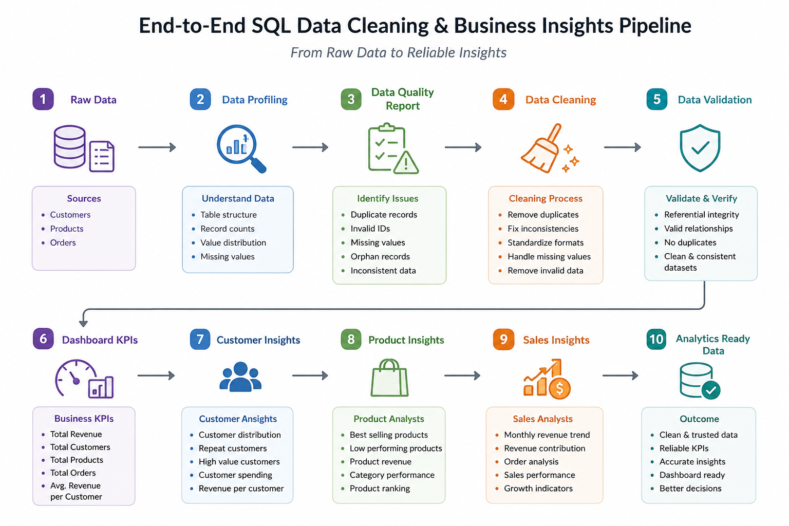
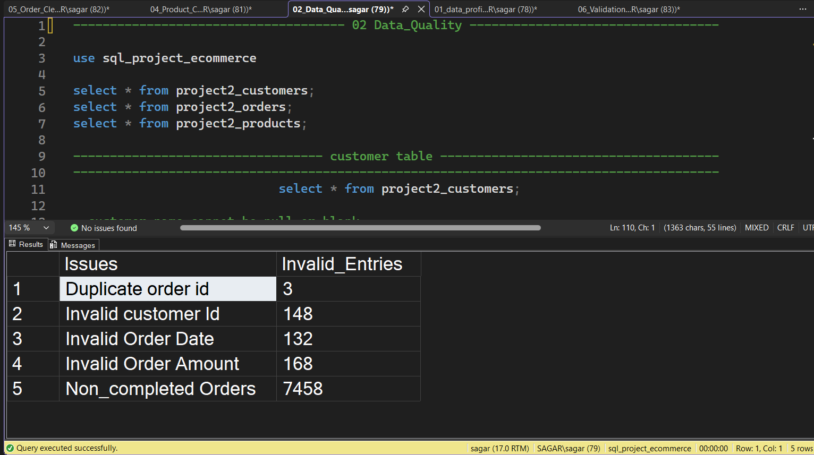
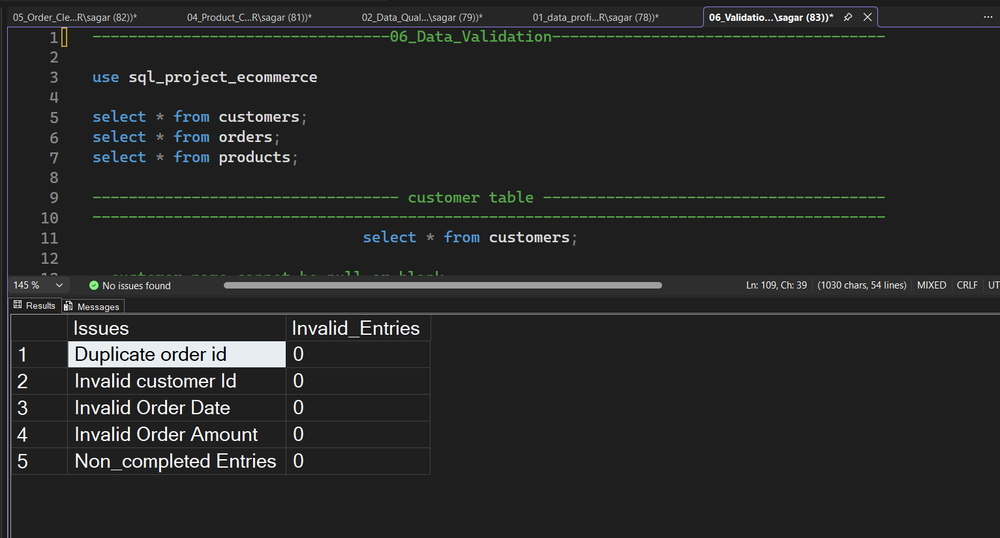
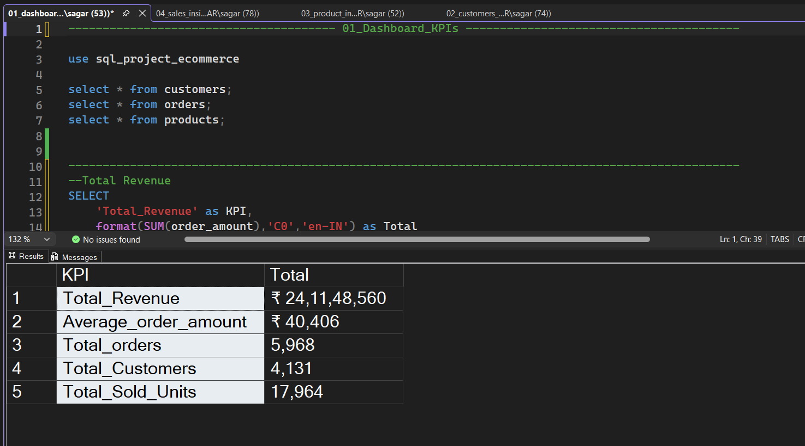

# 📊 End-to-End SQL Data Cleaning & Business Insights Pipeline

An end-to-end SQL Data Analytics project built using **Microsoft SQL Server** that demonstrates how raw business data can be transformed into clean, validated, and analytics-ready datasets through professional data profiling, data quality assessment, data cleaning, validation, KPI reporting, and business insight generation.

Unlike traditional SQL projects that only answer business questions, this project follows the complete **Data Preparation Pipeline** used by Data Analysts before building dashboards and reports.

---

## 🛠 Tech Stack

<p align="left">


</p>

---

# 📋 Project Summary

| Attribute | Details |
|------------|---------|
| Project Type | End-to-End SQL Data Cleaning Pipeline |
| Domain | E-Commerce |
| Database | Microsoft SQL Server |
| Datasets | Customers, Products, Orders |
| SQL Modules | 10 |
| Workflow | Data Profiling → Cleaning → Validation → Business Insights |
| Focus | Data Cleaning & Business Analytics |

---

# ⭐ Key Features

- End-to-End SQL Data Preparation Pipeline
- Data Profiling & Exploration
- Data Quality Assessment
- Customer Data Cleaning
- Product Data Cleaning
- Order Data Cleaning
- Data Validation
- Dashboard KPI Generation
- Customer Insights
- Product Insights
- Sales Insights
- Modular SQL Project Structure

---

# 📈 SQL Data Preparation Workflow



---

# 📖 Project Overview

Real-world business data is rarely analysis-ready. Missing values, duplicate records, invalid references, inconsistent formats, and incorrect relationships often reduce the reliability of reports and dashboards.

This project demonstrates an industry-style SQL workflow that transforms raw customer, product, and order datasets into reliable analytical datasets before performing business analysis.

The project is organized into separate SQL modules, making each stage of the pipeline easier to understand, maintain, and extend.

---

# ❗ Business Problem

📄 [Business Requirements](business_requirements.md)

An e-commerce company wants to generate reliable business insights from customer, product, and order data.

However, the raw datasets contain several quality issues that affect reporting accuracy.

Before business analysis can begin, the datasets must be profiled, cleaned, validated, and transformed into analytics-ready data.

---

# 🎯 Project Objectives

- Understand dataset structure
- Perform data profiling
- Identify data quality issues
- Clean customer data
- Clean product data
- Clean order data
- Validate transformed datasets
- Generate dashboard KPIs
- Extract business insights
- Follow an industry-style SQL workflow

---

# 📂 Dataset Overview

The project uses three relational datasets.

| Dataset | Description |
|----------|-------------|
| Customers | Customer demographic and location information |
| Products | Product catalog, categories and pricing |
| Orders | Customer purchase transactions |

These datasets are connected using relational keys and serve as the foundation for the complete SQL pipeline.

---

# ⚠ Data Quality Challenges

The raw datasets contain several issues commonly found in real-world business data.

The project identifies and resolves:

- Duplicate records
- Invalid Customer IDs
- Invalid Product IDs
- Invalid Order IDs
- Missing values
- Incorrect relationships
- Inconsistent formatting
- Invalid transactional records
- Referential integrity issues

---

# ⚙ SQL Project Workflow

The project is divided into ten logical stages.

## 📊 Stage 1 — Data Profiling

Purpose:

- Understand raw datasets
- Explore table structure
- Review record counts
- Analyze category distribution
- Detect missing values

---

## 🔍 Stage 2 — Data Quality Report

Purpose:

- Identify duplicate records
- Find invalid IDs
- Detect orphan records
- Measure data quality
- Generate quality report

---

## 🧹 Stage 3 — Customer Cleaning

Cleaning includes:

- Duplicate removal
- Standardization
- Invalid record removal
- Customer validation

---

## 📦 Stage 4 — Product Cleaning

Cleaning includes:

- Category standardization
- Invalid product removal
- Product validation
- Formatting corrections

---

## 🛒 Stage 5 — Order Cleaning

Cleaning includes:

- Invalid order removal
- Duplicate orders
- Invalid references
- Relationship validation

---

## ✅ Stage 6 — Data Validation

Validation ensures:

- No duplicate records
- Valid customer IDs
- Valid product IDs
- Correct relationships
- Analytics-ready datasets

---

## 📈 Stage 7 — Dashboard KPIs

SQL generates business-ready KPIs including:

- Total Revenue
- Total Customers
- Total Products
- Total Orders
- Average Revenue per Customer

---

## 👥 Stage 8 — Customer Insights

Business analysis includes:

- Customer Distribution
- Repeat Customers
- High Value Customers
- Customer Spending
- Revenue per Customer

---

## 📦 Stage 9 — Product Insights

Business analysis includes:

- Best Selling Products
- Low Performing Products
- Product Revenue
- Category Performance
- Product Ranking

---

## 💰 Stage 10 — Sales Insights

Business analysis includes:

- Monthly Revenue Trend
- Revenue Contribution
- Order Analysis
- Sales Performance
- Business Growth Indicators

---

# 🧠 SQL Concepts Applied

## Data Exploration

- SELECT
- DISTINCT
- WHERE
- ORDER BY

### Aggregation

- GROUP BY
- HAVING
- COUNT()
- SUM()
- AVG()
- MIN()
- MAX()

### Joins

- INNER JOIN
- LEFT JOIN

### Conditional Logic

- CASE
- ISNULL()
- COALESCE()

### Data Cleaning

- UPDATE
- DELETE
- TRIM()
- REPLACE()
- CAST()
- CONVERT()

### Advanced SQL

- Common Table Expressions (CTEs)
- Window Functions
- ROW_NUMBER()
- RANK()
- DENSE_RANK()
- LAG()

---

# 💻 Technology Overview

| Category | Technology |
|------------|------------|
| Database | Microsoft SQL Server |
| Query Language | SQL |
| Version Control | Git |
| Repository | GitHub |

---

# 📷 Project Screenshots

## Data Quality Assessment



---

## Data Cleaning



---

## Dashboard KPIs



---

# 📁 Repository Structure

```text
end-to-end-sql-data-cleaning-and-business-analytics
│
├── datasets
│   ├── project2_customers.csv
│   ├── project2_products.csv
│   └── project2_orders.csv
│
├── data_cleaning_&_transformation
│   ├── 01_data_profiling.sql
│   ├── 02_Data_Quality_Report.sql
│   ├── 03_Customer_Cleaning.sql
│   ├── 04_Product_Cleaning.sql
│   ├── 05_Order_Cleaning.sql
│   └── 06_Validation.sql
│
├── Business_insights
│   ├── 01_dashboard_KPIs.sql
│   ├── 02_customers_insights.sql
│   ├── 03_product_insights.sql
│   └── 04_sales_insights.sql
│
├── screenshots
│   ├── sql_data_cleaning_workflow.png
│   ├── invalid_entries.png
│   ├── clean_invalid_data.png
│   └── KPIs.png
│
├── business_requirements.md
│
└── README.md
```

---

# 🏆 Project Highlights

- End-to-End SQL Data Cleaning Pipeline
- Industry-Style Data Preparation Workflow
- Professional Data Profiling
- Data Quality Assessment
- Customer Data Cleaning
- Product Data Cleaning
- Order Data Cleaning
- Data Validation
- Dashboard KPI Generation
- Customer Analytics
- Product Analytics
- Sales Analytics
- Modular SQL Architecture
- Business Insight Generation
- Clean Repository Structure

---

# 💡 SQL Skills Demonstrated

### Data Preparation

- Data Profiling
- Data Cleaning
- Data Validation
- Data Transformation

### SQL Development

- Query Writing
- Joins
- Aggregations
- Window Functions
- Common Table Expressions (CTEs)

### Business Analytics

- KPI Reporting
- Customer Analytics
- Product Analytics
- Sales Analytics
- Business Intelligence

---

# 🚀 Future Improvements

Potential future enhancements include:

- SQL Views
- Stored Procedures
- Index Optimization
- Query Performance Tuning
- Power BI Dashboard Integration
- Data Quality Scorecards
- Automated Validation Pipeline
- SQL Server Agent Automation

---

# 👨‍💻 Author

**Sagar Bairwa**

📧 Email: sagar.bairwa.tech@gmail.com

💼 LinkedIn: https://linkedin.com/in/sagarbairwa

💻 GitHub: https://github.com/sagar-bairwa

---

⭐ If you found this project helpful, consider giving it a Star.
